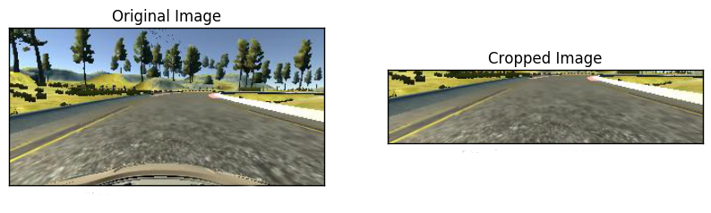

# **Behavioral Cloning**

**Behavioral Cloning Project**

The goals / steps of this project are the following:
* Use the simulator to collect data of good driving behavior
* Build, a convolution neural network in Keras that predicts steering angles from images
* Train and validate the model with a training and validation set
* Test that the model successfully drives around track one without leaving the road
* Summarize the results with a written report

# Data Augmentation

At first, I tried generating my own data from the simulator by running the simulator using the mouse. But the results were not good, so I decided to switch to the data provided by Udacity. However, I added some recovery data (i.e collecting data such that it captures the behavior to follow when the car deviates from the track) to the dataset.

I also used left and right camera images. The left camera image's steering angle had to be adjusted by adding a small angle of 0.3 and the right camera image's steering angle had to be adjusted by subtracting a small angle of 0.3.

# Preprocessing

A Keras's lambda layer was added to normalize all the images to range between 0 and 1 and mean center them so that losses are smaller.

The original images were cropped using Keras's Cropping2D layer by 70 px from the top and 25 px from the bottom. They were cropped to remove the top portion (sky, trees and other details) which only proved as a distraction to the network. And the bottom of the image was cropped as it was only displaying the car hood.

# Model Architecture

At first, I used LeNet architecture to solve the problem but the model did not perform well. Then I switched to the model described by Nvidia in [this paper](http://images.nvidia.com/content/tegra/automotive/images/2016/solutions/pdf/end-to-end-dl-using-px.pdf). I used a GPU (GeForce GTX 1070) to train my model which proved quite helpful as the training time was greatly reduced as when I tried to train it on my CPU.

I made some modifications to the network to solve my problem better. I used ELU (Exponential Linear Units) activation layers to introduce nonlinearity in my model. And added a dropout layer after the convolution layers to prevent overfitting.

|Layer (type)   |
|---|
|Input (160,320,3)|
| Lambda (160,320,3) |
| Cropping  (65,320,3)|
| Convolution with 24 5x5 filters |
|Activation ELU|
| Convolution with 36 5x5 filters  |
|Activation ELU|
| Convolution with 48 5x5 filters  |
|Activation ELU|
| Convolution with 64 3x3 filters  |
|Activation ELU|
| Convolution with 64 3x3 filters  |
|Activation ELU|
|Dropout 0.3|
|Flatten|
|Dense (100 nuerons)|
|Dense (50 nuerons)|
|Dense (10 nuerons)|
|Dense (1 nueron)|

I optimized the model with an Adam optimizer and used mean square error as the loss function.

# Testing

I trained my model for 10 epochs and used 20% of the data for validation. Finally, I received minimal training and validation loss and my car was able to drive well around the track, without ever crashing or going off the road.
